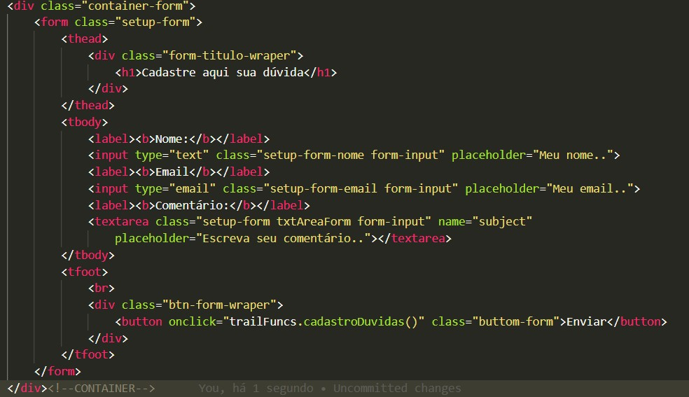

# Programação de Funcionalidades

Pré-requisitos: <a href="2-Especificação do Projeto.md"> Especificação do Projeto</a>, <a href="3-Projeto de Interface.md"> Projeto de Interface</a>, <a href="4-Metodologia.md"> Metodologia</a>, <a href="3-Projeto de Interface.md"> Projeto de Interface</a>, <a href="5-Arquitetura da Solução.md"> Arquitetura da Solução</a>

Implementação do sistema descritas por meio dos requisitos funcionais e/ou não funcionais. Deve relacionar os requisitos atendidos os artefatos criados (código fonte) além das estruturas de dados utilizadas e as instruções para acesso e verificação da implementação que deve estar funcional no ambiente de hospedagem.

Para cada requisito funcional, pode ser entregue um artefato desse tipo

# Funcionalidades:

## 1- Carlos José
`Carrossel`

Carrossel

## 2- Leonardo Lima
`Filtro Pesquisa`

Filtro

Veja Mais

## 3- Leonardo Buck
`Botão Compartilhar`

Botão Compartilhar

## 4- Rafael Santana
`Cadastro de Trilhas`

.png)

Cadastro de Trilhas

## 5- Diogo Silva
`Formulário`

Formulário

