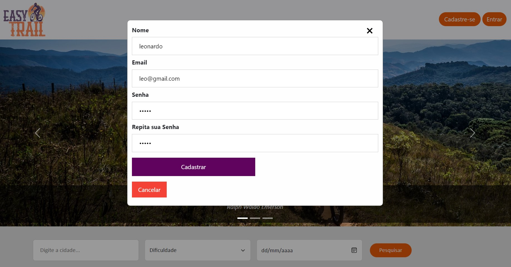

# Registro de Testes de Software

Pré-requisitos: <a href="04-Projeto de Interface.md"> Projeto de Interface</a>, <a href="08-Plano de Testes de Software.md"> Plano de Testes de Software</a>

Abaixo as evidências dos testes de software realizados no sistema pela equipe, baseado em um plano de testes pré-definido.

## Casos de Testes

> **Caso de Teste 05**:

.jpg)
